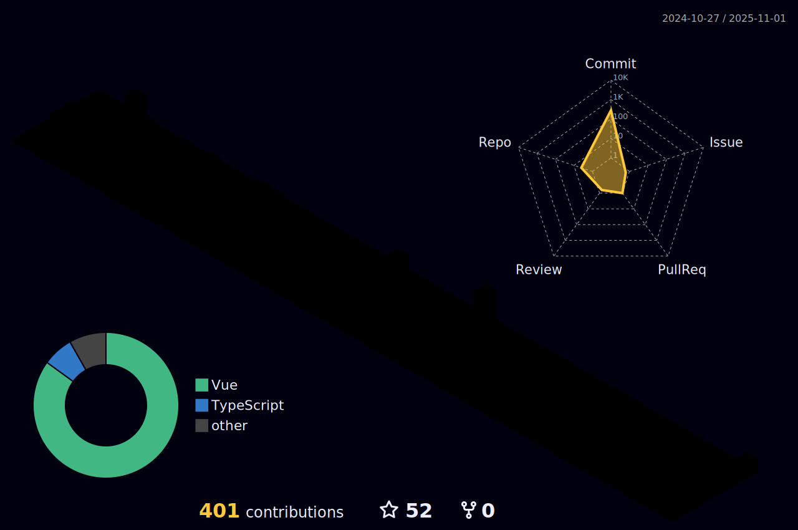

<h1 align="center">Hello ${World} 👋</h1>

I'm a fullstack developer with 4 years of experience working with modern web technologies.  
I focus on building scalable applications using TypeScript, Vue (Nuxt), React, Node.js, and Laravel.

  
  
  
  

 

 

 |  
 |  |  
 | ----------- | ----------- |

 

 

